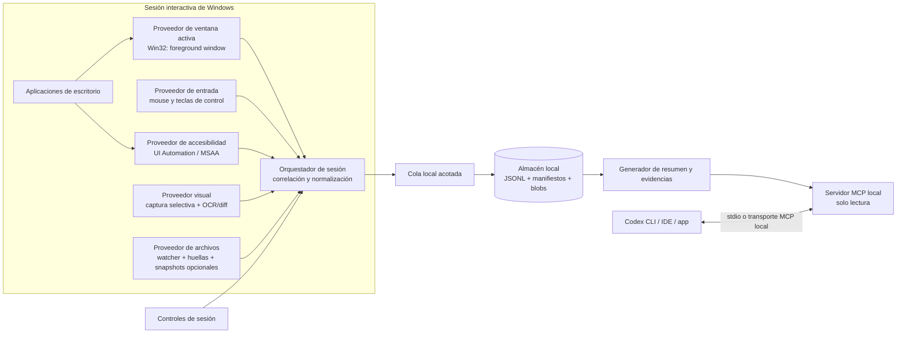
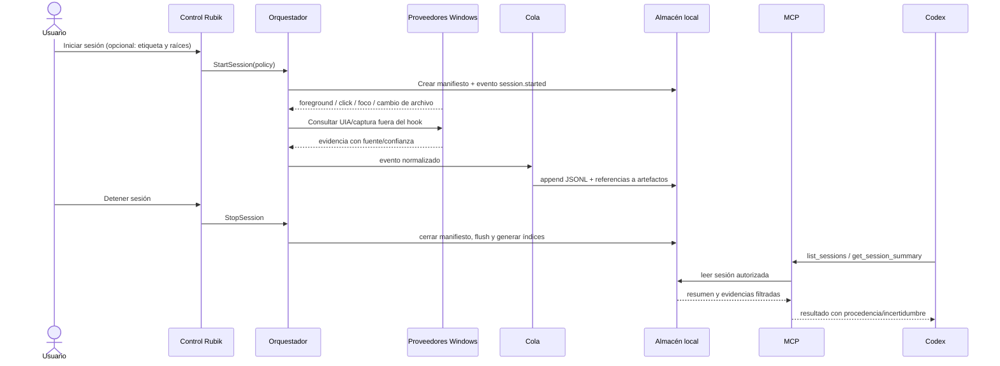

# Rubik — arquitectura de observación de actividad de escritorio

## 1. Propósito y alcance

Rubik registra, durante una sesión iniciada explícitamente por la persona, acciones realizadas en aplicaciones de Windows y evidencias del estado resultante. Su objetivo es que un agente pueda reconstruir una secuencia útil —incluidos cambios manuales posteriores a una intervención de Codex— sin depender de una aplicación concreta.

Rubik no promete conocer la semántica interna de cualquier programa. Combina fuentes independientes, conserva su procedencia y expresa incertidumbre cuando solo dispone de evidencia visual o indirecta. En esta primera iteración se propone una aplicación local para Windows, almacenamiento JSONL/JSON y un servidor MCP de solo lectura para que Codex consulte las sesiones.

### Objetivos

- Observar la ventana activa y su proceso, clics con coordenadas y cambios de foco.
- Leer controles y valores accesibles con Windows UI Automation (UIA) cuando la aplicación los exponga.
- Detectar cambios en pantalla y, opcionalmente, extraer texto mediante OCR.
- Detectar cambios en archivos elegidos o en un directorio de trabajo, sin asumir que todos los formatos son interpretables.
- Mantener una cronología local consultable y exportable.
- Ofrecer a Codex herramientas MCP explícitas para listar sesiones, consultar eventos y obtener un resumen/evidencia.

### Fuera del alcance inicial

- Interpretar con certeza todos los formatos binarios o estados internos de aplicaciones arbitrarias.
- Capturar el texto completo de todas las pulsaciones de teclado.
- Enviar datos a la nube automáticamente.
- Controlar o modificar aplicaciones vigiladas.

## 2. Principios de diseño

1. **Local primero:** las capturas, eventos y documentos observados permanecen en el equipo. MCP expone datos bajo demanda.
2. **Sesión visible y controlable:** grabar solo entre `StartSession` y `StopSession`; indicador visible, pausa y descarte.
3. **Mínima captura:** registrar teclas de control (Enter, Tab, Escape, atajos) y secuencias de edición como metadatos solo si se habilita. No guardar texto bruto por defecto.
4. **Procedencia y confianza:** cada observación indica si viene de API, UIA, OCR, imagen, sistema de archivos o inferencia.
5. **Degradación segura:** si un proveedor no está disponible, continuar con los demás y señalar huecos.
6. **MCP de solo lectura:** las herramientas entregadas a Codex no inician ni detienen vigilancia ni ejecutan acciones en las aplicaciones.
7. **Bajo acoplamiento:** captura, normalización, almacenamiento, resumen y transporte MCP son componentes separados.

## 3. Vista de componentes



### Componentes

| Componente | Responsabilidad | Observaciones |
|---|---|---|
| Control de sesión | Iniciar, pausar, reanudar, finalizar y borrar una sesión; mostrar indicador | Bandeja de sistema/ventana ligera y atajos explícitos |
| Ventana activa | Obtener HWND, PID, título, ejecutable, rectángulo, monitor y DPI | Muestrear cambios de foreground y consultar al ocurrir una acción |
| Entrada | Observar clics/rueda y teclas especiales | Hooks de bajo nivel en proceso interactivo; evitar registrar texto global |
| UIA | Consultar foco, elemento bajo cursor, rol, nombre, valor y patrón disponible | Reintentos limitados; llamadas fuera del callback del hook |
| Visual | Captura de región/ventana en hitos, comparación perceptual y OCR opcional | Evitar vídeo continuo; política de exclusión por proceso/ventana |
| Archivos | Vigilar raíces configuradas, estabilizar escrituras y guardar hashes/diffs cuando sea posible | No leer indiscriminadamente el perfil del usuario |
| Correlador | Agrupar ráfagas de interacción como acciones y enlazar evidencias cercanas | Mantener hechos observados separados de inferencias |
| Almacén | Persistir manifiesto, eventos y artefactos | JSONL append-only por sesión; rotación y retención configurable |
| MCP | Exponer consultas acotadas para Codex | Sin herramientas de captura/control en la primera iteración |

## 4. Fuentes de observación en Windows

### 4.1 Ventana y proceso

El proveedor Win32 consulta la ventana en primer plano (`GetForegroundWindow`) y obtiene PID/TID, título cuando sea accesible, clase, límites (`GetWindowRect` o equivalentes), monitor y contexto DPI. Debe volver a consultar al cambiar foreground y alrededor de eventos relevantes: el foco puede cambiar entre el muestreo periódico.

Los títulos pueden contener nombres de documentos o datos privados. La política configurable debe permitir guardar título literal, normalizarlo o sustituirlo por un identificador de ventana. El proceso se identifica por ruta/nombre y PID de esa sesión, no se asume que el PID sea estable entre ejecuciones.

### 4.2 Mouse y teclado

Un hook de entrada de bajo nivel recibe tipo de evento, timestamp y coordenadas de pantalla para clic/rueda. El callback debe ser corto: copiar los campos mínimos a una cola acotada y retornar; UIA, captura, OCR y disco se procesan en un worker para no bloquear la entrada.

Las coordenadas deben incluir espacio de referencia y contexto de monitores/DPI. Guardar `{x,y, coordinate_space, monitor_id, dpi_scale}` evita tratar píxeles físicos como coordenadas lógicas. Para cada clic se puede consultar el HWND bajo cursor y contrastarlo con foreground.

El modo predeterminado no persiste caracteres, texto de portapapeles ni secuencias de escritura. Puede guardar tecla virtual de teclas de control, modificadores y límites temporales de una ráfaga. Si en el futuro se ofrece captura de texto para un caso concreto, debe ser opt-in por sesión/proceso, visible, con exclusión de controles sensibles y retención corta.

### 4.3 UI Automation y MSAA

Ante un clic o cambio de foco, el worker intenta localizar el elemento con foco y/o el elemento bajo el cursor. Extrae solo propiedades necesarias: `AutomationId`, `Name`, `ControlType`, `ClassName`, patrón de valor si existe, rectángulo y estado de sensibilidad cuando esté disponible. Captura valor antes/después cuando el proveedor lo expone y el cambio puede atribuirse a una acción.

UIA permite inspeccionar controles que las aplicaciones publiquen a través de proveedores de accesibilidad; no descubre universalmente el modelo de dominio. Algunas interfaces basadas en canvas, juegos, superficies GPU o componentes personalizados pueden exponer un árbol vacío/incompleto. MSAA puede ser un fallback para aplicaciones antiguas. Los proveedores lentos o bloqueados se consultan con timeout y fuera del callback de entrada.

### 4.4 Pantalla, OCR y comparación

La captura visual se dispara por hitos (cambio de foreground, clic en control relevante, confirmación/guardado y solicitud del usuario), no necesariamente a una frecuencia fija. Se puede guardar una región de ventana o recorte alrededor del control; la captura completa requiere configuración explícita. OCR propone texto y cajas con confianza; el diff visual identifica regiones cambiadas, pero no atribuye por sí solo significado semántico.

Cada observación visual incluye hash, hora, región, resolución, método OCR y confianza. El sistema puede guardar solo recortes o miniaturas según política. Debe admitir lista de exclusión por ejecutable y botón de pausa inmediata.

### 4.5 Sistema de archivos

Vigilar solo directorios seleccionados por el usuario o asociados a una sesión/proyecto. Agrupar eventos duplicados, esperar estabilidad de tamaño/tiempo antes de calcular hash y no asumir que un evento de watcher equivale a un guardado completo. Para texto se pueden generar diffs. Para binarios, registrar ruta, tamaño, timestamps y hashes; adaptadores opcionales podrán extraer metadatos de formatos particulares.

Un snapshot es una copia del artefacto y tiene mayor impacto de privacidad/almacenamiento que una huella; se configura aparte. Nunca seguir enlaces o expandir raíces fuera de las rutas permitidas sin configuración explícita.

## 5. Flujo de datos y ciclo de vida



Estados: `idle → recording → paused → recording → finalizing → complete`. Una caída del proceso deja un manifiesto `interrupted`; al reiniciar, recuperación valida el JSONL hasta la última línea completa y nunca reanuda captura automáticamente.

## 6. Modelo de datos

### 6.1 Manifiesto de sesión

Campos recomendados: `schema_version`, `session_id` (UUID), `started_at`, `ended_at`, `status`, `label`, `host_os`, configuración efectiva de captura, lista de proveedores, aplicaciones/directorios incluidos y excluidos, rutas relativas de eventos/artefactos y política de retención. No incluir secretos ni contenido de documentos por defecto.

### 6.2 Evento normalizado

```json
{
  "schema_version": 1,
  "event_id": "uuid",
  "session_id": "uuid",
  "ts_utc": "2026-09-26T20:32:10.125Z",
  "monotonic_ms": 19452,
  "kind": "ui.value_changed",
  "source": "uia",
  "confidence": 0.98,
  "window": {
    "process_name": "sample-app.exe",
    "process_id": 1234,
    "title_redacted": "Diseño — documento",
    "window_id": "win-2",
    "bounds": {"x": 100, "y": 80, "width": 1200, "height": 800},
    "monitor_id": "DISPLAY1",
    "dpi": 144
  },
  "action": {"type": "click", "x": 812, "y": 436, "coordinate_space": "physical_screen"},
  "target": {
    "automation_id": "dimension-width",
    "name": "Width",
    "control_type": "Edit",
    "value_before": "20",
    "value_after": "25",
    "value_redacted": false
  },
  "evidence": [{"artifact_id": "artifact-7", "kind": "uia_snapshot", "relation": "after"}],
  "correlation_id": "action-42",
  "notes": []
}
```

`kind` diferencia eventos brutos de acciones inferidas. Una inferencia debe registrar `derived_from` (IDs fuente), reglas/algoritmo y nivel de confianza. No convertir OCR o cambios de píxel en un supuesto valor semántico sin anotarlo como inferido.

### 6.3 Almacenamiento

```text
%LOCALAPPDATA%/Rubik/
  config.json                 # preferencias no secretas
  sessions/<session-id>/
    manifest.json
    events.jsonl              # append-only
    summary.json              # materializado al cerrar/solicitar
    artifacts/<artifact-id>   # capturas/recortes opcionales
```

La ubicación debe ser configurable. JSONL facilita append y recuperación; artefactos se referencian por ID y hash. Aplicar ACL del usuario actual, límites de tamaño, retención configurable, borrado de sesión y exportación manual. No registrar datos sensibles en logs de diagnóstico.

## 7. Interpretación de acciones y resultado

Un correlador convierte eventos cercanos en una acción candidata: interacción (clic/foco/tecla de control), control UIA implicado, valor antes/después, evidencia visual y cambios de archivos en una ventana temporal. La agregación debe conservar los eventos originales y producir una narración derivada, por ejemplo: “se cambió el campo Ancho de 20 a 25 y se guardó el documento”.

Jerarquía sugerida de evidencia:

1. API/plugin del producto o dato estructurado de archivo, si el usuario lo instaló.
2. UIA: nombre/valor/control y cambio observado.
3. OCR localizado y cambio visual concordante.
4. Secuencia de entrada + cambio de archivo/imagen sin lectura semántica.
5. Inferencia temporal débil.

El resumen cita IDs de evento/artefacto para que Codex pueda inspeccionar evidencia concreta. Si dos señales discrepan, reportar ambas y bajar confianza.

## 8. Integración con Codex mediante MCP

### 8.1 Límites

El servidor MCP es un proceso local independiente. Lee el almacén Rubik y publica un contrato estable, sin exigir que Codex tenga acceso directo al hook de entrada. Codex se configura para arrancar el servidor local por stdio o, si la distribución lo requiere, por transporte local autenticado. No abrir un puerto de red sin necesidad.

### 8.2 Herramientas MCP propuestas

| Herramienta | Entrada | Salida | Efecto |
|---|---|---|---|
| `rubik.list_sessions` | `limit`, `since`, `status` | sesiones resumidas | Solo lectura |
| `rubik.get_session_summary` | `session_id` | objetivo/intervalo, cambios, evidencias, huecos y confianza | Solo lectura |
| `rubik.get_events` | `session_id`, filtros de tiempo/tipo, `limit` | eventos paginados y cursores | Solo lectura |
| `rubik.get_artifact` | `session_id`, `artifact_id` | metadatos y contenido permitido o referencia local | Solo lectura, validar tamaño y ruta |
| `rubik.search` | `session_id`, texto/tipo, límite | coincidencias con offsets/IDs | Solo lectura |

No ofrecer inicialmente `start_recording`, `stop_recording`, `delete_session`, shell, automatización UI ni herramientas que devuelvan datos sin límite. Los controles de captura pertenecen a la interfaz local. El usuario decide qué sesión consultar; las respuestas limitan tamaño y redactan según política.

### 8.3 Configuración de proyecto

Codex puede conectar un servidor local en configuración de usuario o de proyecto. Para una instalación de desarrollador, el registro stdio debe invocar un ejecutable/script instalado, no depender de una ruta temporal. Secretos no van en TOML versionado. Un ejemplo ilustrativo (ajustar al paquete real al implementarlo):

```toml
[mcp_servers.rubik]
command = "rubik-mcp"
args = ["serve", "--stdio"]
enabled = true
```

El agente `rubik-codex-integrator` de `.codex/agents/` prepara esta integración: verifica contrato y transporte MCP, documenta instalación/configuración, ofrece un ejemplo de configuración apto para Codex y evita editar automáticamente `%USERPROFILE%/.codex/config.toml`. La persona instala/activa el servidor usando el mecanismo soportado por su versión de Codex.

## 9. Seguridad y privacidad

- Captura desactivada hasta inicio explícito; indicador persistente y pausa inmediata.
- Exclusión por proceso, título, control sensible y directorio; lista de permitidos opcional.
- No persistir contraseñas, texto global de teclado, clipboard ni contenido completo de pantalla por defecto.
- Recortes/capturas OCR bajo política explícita; previsualizar y borrar sesión completa.
- MCP limitado al almacén configurado; validar IDs, rutas, límites y paginación contra path traversal y lecturas arbitrarias.
- No incluir captura ni sesión activa en los resultados salvo solicitud expresa; filtrar datos potencialmente sensibles.
- ACL local, cifrado de disco recomendado como responsabilidad del sistema operativo; cifrado por sesión puede añadirse si se define gestión de claves.
- Eventos tratados como datos no confiables: títulos, nombres UIA y OCR pueden contener instrucciones maliciosas. El agente debe tratarlos como evidencia, nunca como instrucciones ejecutables.
- Retención y borrado visibles; el proceso no debe ocultarse ni instalarse como servicio encubierto.

## 10. Fallos, límites y observabilidad

| Condición | Comportamiento esperado |
|---|---|
| UIA no disponible/timeout | Registrar `provider_unavailable`, usar señal visual/archivo si está habilitada |
| Hook saturado | Descartar eventos de menor prioridad, incrementar contador de pérdida y notificar |
| Escritura de archivo parcial | Esperar estabilidad y registrar eventos agrupados |
| Aplicación elevada/escritorio seguro | Marcar tramo no observado; no intentar evadir límites de Windows |
| Coordenadas/DPI inconsistentes | Adjuntar contexto del monitor y señalar baja confianza espacial |
| Disco lleno/JSONL corrupto | Pausar captura, preservar segmento válido y avisar al usuario |
| MCP apagado | La sesión se sigue guardando localmente; consulta disponible cuando vuelva |
| App termina inesperadamente | Recuperar como `interrupted`, no reanudar captura sin acción del usuario |

Métricas locales: eventos por proveedor, latencia de callbacks, descartes de cola, fallos/timeouts UIA, bytes guardados, capturas realizadas y huecos de cobertura. Diagnóstico opt-in, sin telemetría remota.

## 11. Primera iteración (MVP)

### Fase A: observador de sesión

- Aplicación Windows en .NET con icono de bandeja, indicador visible, botones iniciar/pausar/finalizar.
- Captura de foreground, cambios de ventana, clics y rueda; registrar teclas de control sin texto.
- Snapshot UIA de foco y elemento bajo cursor en worker, con nombre/tipo/valor si están disponibles.
- JSONL/manifiesto y límites de cola; exclusión de procesos y directorios.
- Capturas opcionales bajo demanda, no grabación continua.

### Fase B: MCP local

- Servidor stdio de solo lectura que implementa `list_sessions`, `get_session_summary` y `get_events` paginados.
- Esquema versionado, pruebas de contrato y documentación de puesta en marcha en Codex.
- Agente de integración confirma conexión y ayuda a resolver la configuración sin modificar archivos personales globales automáticamente.

### Fase C: correlación y resultado

- Correlación temporal entrada/UIA/cambio de foreground.
- Watcher de directorios explícitos y hashes; diffs para formatos de texto.
- Resumen determinista de cambios observados; OCR/diff visual como fuente opcional.
- Mostrar evidencia, nivel de confianza y huecos en cada resumen.

### Criterios de aceptación

1. El usuario puede iniciar/detener y ve claramente cuándo hay captura.
2. Una sesión registra foreground y clics con coordenadas correctamente contextualizadas para DPI/monitor.
3. Si una app expone un campo editable por UIA, un cambio de valor queda como before/after con fuente UIA; si no, no se inventa.
4. Al cerrar/reabrir, los eventos previos siguen legibles y sesiones incompletas se marcan como interrumpidas.
5. Codex puede listar sesiones y obtener eventos/resumen a través de MCP local, con paginación y sin acceso a otras rutas.
6. El modo predeterminado no guarda texto bruto global ni capturas continuas.

## 12. Estructura de solución sugerida

```text
src/
  Rubik.Contracts/       # DTOs, esquema y validación
  Rubik.WindowsAgent/    # UI, hooks, UIA, foreground, lifecycle
  Rubik.Storage/         # JSONL, manifests, artifacts, retención
  Rubik.Correlation/     # agrupación, evidencia y confianza
  Rubik.McpServer/       # transporte stdio + tools de consulta
tests/
  Rubik.Contracts.Tests/
  Rubik.Storage.Tests/
  Rubik.McpServer.Tests/
docs/
  threat-model.md
  data-schema.md
  codex-setup.md
```

Los proyectos pueden ajustarse al lenguaje/runtime elegido; la separación de interfaces es el contrato arquitectónico importante, no una obligación de adoptar .NET en todos los módulos.

## 13. Agentes de Codex incluidos

Los TOML en `.codex/agents/` son definiciones de subagentes de proyecto. Los roles propuestos cubren contratos/arquitectura, captura de Windows, persistencia/correlación, MCP/Codex y revisión de privacidad. El agente `rubik-codex-integrator` se responsabiliza específicamente de dejar documentada y verificable la conexión con Codex. Los agentes describen responsabilidades; no significan que el producto ya esté implementado.

## 14. Glosario

- **Evento observado:** dato directamente reportado por una API/proveedor (por ejemplo, clic o valor UIA).
- **Acción correlacionada:** grupo de eventos relacionados temporalmente.
- **Inferencia:** explicación derivada de señales indirectas, con procedencia y confianza.
- **Artefacto:** captura, recorte, diff o snapshot referenciado desde un evento.
- **MCP:** protocolo por el cual un cliente como Codex consulta herramientas/datos de un servidor.
- **UIA:** Windows UI Automation, interfaz de accesibilidad para consultar elementos de controles.

## 15. Referencias de integración

- [Codex: subagentes](https://learn.chatgpt.com/docs/agent-configuration/subagents): formato y ubicación de agentes de proyecto.
- [OpenAI Developers: MCP para documentación](https://developers.openai.com/learn/docs-mcp): ejemplo oficial de conectar un servidor MCP a Codex.
- [OpenAI Developers: plugins](https://developers.openai.com/api/docs/guides/agents-api/tools/plugins): empaquetado de configuración MCP para plugins, alternativa si Rubik se distribuye como plugin.
